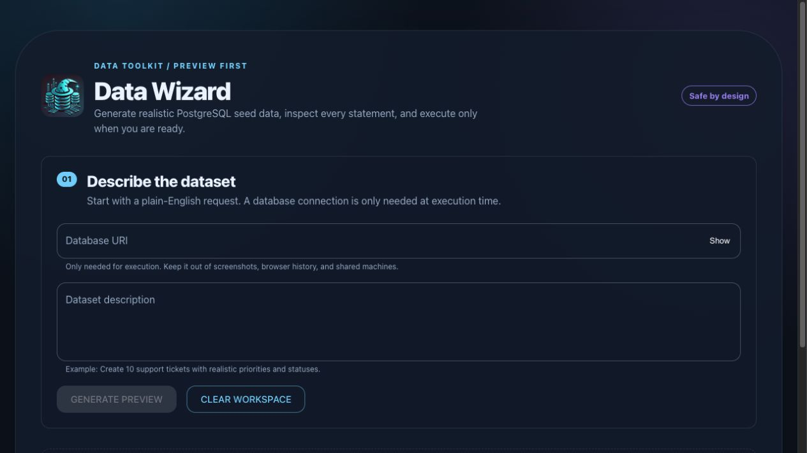
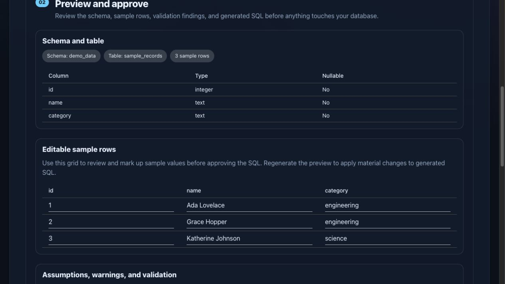

# DataWizard

DataWizard turns a natural-language dataset request into a reviewable PostgreSQL seed plan. It validates the model output, renders deterministic SQL, shows a preview, and executes only after explicit confirmation.


## Why it exists

Creating realistic development data is slow and repetitive. DataWizard gives engineers a safe, inspectable path from “make 20 pizza shops with menus” to a disposable PostgreSQL dataset without hiding the generated schema or SQL.

## Features

- Structured OpenAI dataset planning with domain validation.
- Preview-first workflow: inspect schema, rows, SQL, assumptions, and policy findings before execution.
- Fail-closed PostgreSQL SQL policy and bounded database execution.
- React client, Express API, shared request/response contracts, and Jest coverage.
- Request IDs, redacted logs, health/readiness endpoints, rate limits, and configurable CORS.

## Architecture

```text
React client -> shared API contracts -> Express API
                                      |-> OpenAI adapter -> validated plan
                                      |-> deterministic SQL renderer -> AST policy
                                      `-> PostgreSQL executor (explicit confirmation)
```

See [docs/architecture.md](docs/architecture.md) for module responsibilities and [docs/security.md](docs/security.md) for trust boundaries.

## Quick start

### Prerequisites

- Node.js 20 or newer
- Docker Desktop (optional, for the local PostgreSQL demo)
- An OpenAI API key for live generation

```bash
git clone https://github.com/mmeyer23/dataWizard.git
cd dataWizard
npm ci
cp .env.example .env
```

Put your key in `.env` as `OPENAI_API_KEY`. Keep `.env` local and never commit it.

### Run the demo

Start the isolated database when you want to exercise execution:

```bash
docker compose up -d postgres
```

Start the API and React development server together:

```bash
npm run devc
```

For a credential-free UI walkthrough, use the deterministic local demo provider:

```bash
npm run demo
```

Demo mode is explicitly non-production, labels its generated data, and disables database execution. It does not require `OPENAI_API_KEY`.

Open [http://localhost:8080](http://localhost:8080). The browser proxies `/api` to the API on port 3000. The API also exposes `/health`, `/ready`, and `/metrics` for local diagnostics.

If you prefer separate processes, use `npm start` and `npm run dev` in two terminals.

## Example prompts

- “Create 12 coffee shops with names, cities, opening dates, and a 1–5 rating.”
- “Create a small bookstore dataset with authors, books, and prices.”
- “Generate 20 employees with departments, start dates, and email addresses.”

Always review the generated SQL and policy findings before confirming execution. Use a disposable database and a least-privilege role; see [docs/security.md](docs/security.md).

## Development commands

| Command                        | Purpose                                              |
| ------------------------------ | ---------------------------------------------------- |
| `npm run dev`                  | Frontend development server on port 8080             |
| `npm start`                    | Express API on port 3000                             |
| `npm test -- --runInBand`      | Unit and integration tests without external services |
| `npm run testc -- --runInBand` | Tests with coverage output                           |
| `npm run typecheck`            | TypeScript checking for JS/JSDoc contracts           |
| `npm run lint`                 | ESLint syntax and debugging checks                   |
| `npm run format:check`         | Prettier documentation/configuration check           |
| `npm run build`                | Production frontend bundle                           |
| `npm run bundle:check`         | Enforce production bundle and asset budgets          |
| `npm run verify`               | Full local quality gate                              |

The PostgreSQL integration test is opt-in and uses `DATA_WIZARD_TEST_DATABASE_URL`; the normal test suite never needs real credentials.

## Screenshots and demo

These screenshots use the deterministic local demo provider. They contain no credentials, connection URIs, or live database data.

### Start with a plain-English request



Describe the seed dataset you need, then generate a reviewable plan. A PostgreSQL connection is needed only if you later choose to execute approved SQL.

### Review the generated plan before execution



Inspect the proposed schema and editable sample rows before approving SQL. In demo mode, execution is disabled, making it safe to explore the workflow locally.

## Roadmap

See [docs/roadmap.md](docs/roadmap.md) for planned improvements, including richer schema previews, provider abstraction, and deployment examples.

## Contributing

Read [AGENTS.md](AGENTS.md), choose a focused issue branch, run `npm run verify`, and reference the issue in your commit and pull request. Keep generated bundles, coverage, and secrets out of source control.

## Project history and maintenance

DataWizard was originally developed collaboratively by Mason Meyer, Anna Kempel, Aaron Jacobs, and Alex Grimm.

This repository is Mason Meyer’s maintained fork. It preserves that collaborative foundation while independently extending the project with a preview-first workflow, deterministic SQL validation, security hardening, automated testing and CI, local demo mode, improved documentation, and a redesigned user experience.

## License

DataWizard is licensed under the ISC License. See [LICENSE](LICENSE).
